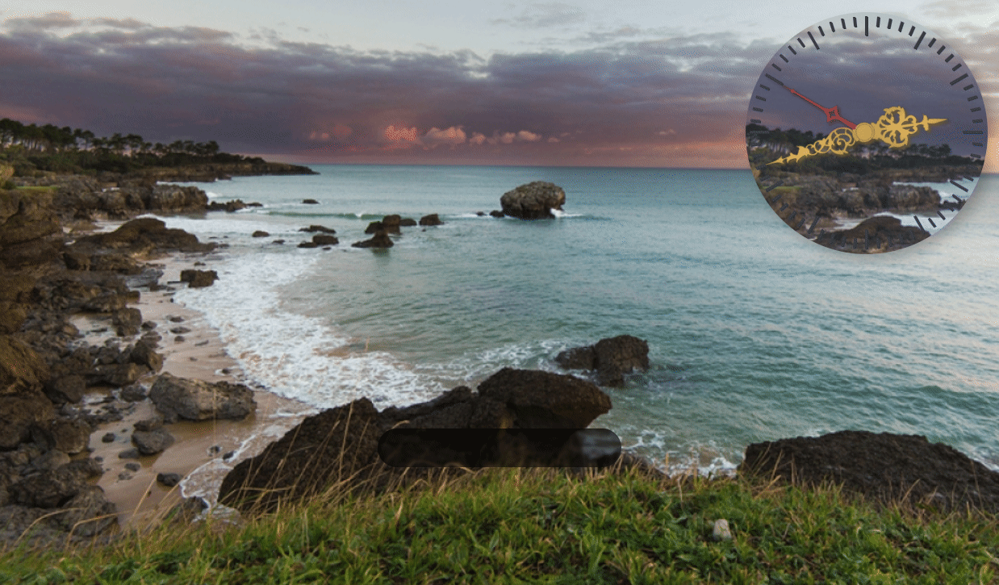
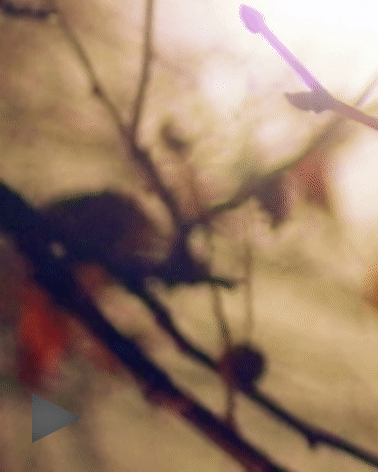

# ff-homepage

# Live: https://hectorvilas.github.io/ff-homepage/

## About it
This is a project for personal use, a home page for my Firefox browser. It's purpose is not just for practice, I want to have some info on screen each time I open the browser. The time, a search bar for DuckDuckGo, Google and others, a customizable favorites list (because the adress bar is not focused and I want to do everything keyboard only), the weather and whatever I could find useful.

## roadmap

The page:
- ⭕date:
- - ✅clock
- - ❌full date
- - ❌almanac
- ⭕search pages:
- - ✅search bar
- - ❌tabs to change page
- ❌weather
- - ❌location selection
- - ❌next 24 hours temp
- - ❌general weather
- - ❌filter
- ❌favorites bar
- - ❌configurable list
- - ❌focused on load
- - ❌usable with keyboard only
- ❌notes
- - ❌editable
- - ❌deleteable
- - ❌optional countdown
- ❌music player (aersia.net)
- ❌ask if user wants to close window if:
- - ❌music player has been used
- - ❌a note is being edited

The code:
- ❌`async`/`await` for weather
- ❌`localStorage` to keep everything saved, nothing hard coded
- ❌`.preventDefault()` so tabbing is always inside the page

## updates

I'm not going to update this README.md frequently, there's no purpose on it if I'm going to do something for personal use (mainly), but I'm going to leave some thoughts and images to see my progress. In any case, the commits describing the changes can be found in this same repository.

This is what I got for now:

The clock took me some time to make, mostly because the design and the transition will make it go backwards once a hand reaches zero, but it got fixed. Hands made with InkScape.

The wallapers are random nature images from [placeimg.com](https://placeimg.com/).

The search bar was surprisingly easy to make. It's just a form sent to DuckDuckGo or Google. The only disadvantage with this is the lack of autocompletion, so maybe I'll replace it with buttons for shortcuts.

---

music player added with `<iframe>`.

It was easy, just an `iframe` with aersia.net as source. To not waste their website's bandwith, I added a button that will add the source to an invisible `iframe` and then unhide it, so now it will load their page and not every time it's open.

The button is made with `clip-path`. The good thing is that I can add a shiny effect on hover. The bad thing is I can barely change it's style.